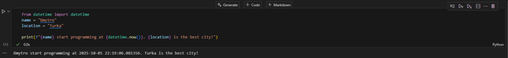
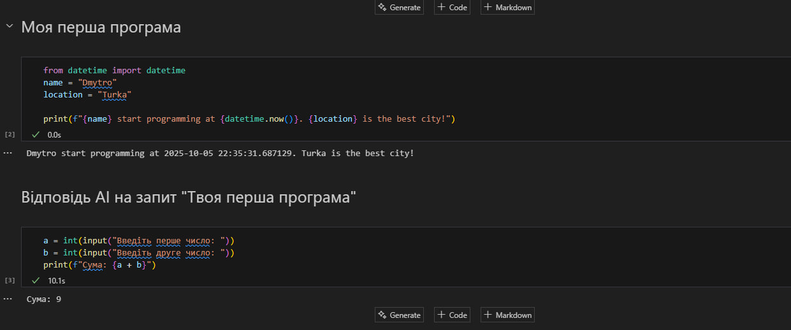

# Звіт до роботи
## Тема: Налаштування середовища, прочаток роботи з Python та Markdown. Створення першої програми
### Мета роботи: Налаштувати середовище роботи VS Code, створити репозиторій Github та налаштувати інтеграцію з ним, написати першу програму на Python та створити звіт з використанням форматування Markdown;

---
### Виконання роботи

* 
    1. Створив репозиторій та почав працювати в ньому. Також створив першу програму
    2. Програма вивела значення " Dmytro start programming at 2025-10-05 21:53:34.177346. Turka is the best city! "
    3. Навчились працювати з різними розширенями файлів, створювати примітивні програми та запускати їх.

* вставлені рисунки (скріншоти екрана або фотографії виконаного завдання у зошиті);
 
*  

    4. Вставлення першої програми напряму кодом у Git 

    ```python
    from datetime import datetime
        name = "Dmytro"
        location = "Turka"
    print(f"{name} start programming at {datetime.now()}. {location} is the best city!")
    ```


    5. Результат запиту до AI "Твоя перша програма"

* 


---
### Висновок:
> у висновку потрібно відповісти на запитання:

- :question: Що зроблено в роботі;
> Налагодили базові функції для подальшої роботи з інструментами. (Потихенько щупаєм з чим будемо мати справу :grin:) 
- :question: Чи досягнуто мети роботи;
> Звісно 
- :question: Які нові знання отримано;
> Робота Git у такті з VS
- :question: Чи вдалось відповісти на всі питання задані в ході роботи;
> Так 
- :question: Чи вдалося виконати всі завдання;
> Звісно
- :question: Чи виникли складності у виконанні завдання;
> На жаль, ні 
- :question: Чи подобається такий формат здачі роботи (Feedback);
> Так це цікавіше за word-формат
- :question: Побажання для покращення (Suggestions);
> Якщо про роботу поки сказати не можу. А так то здоров'я і терпіння :confetti_ball:   

---