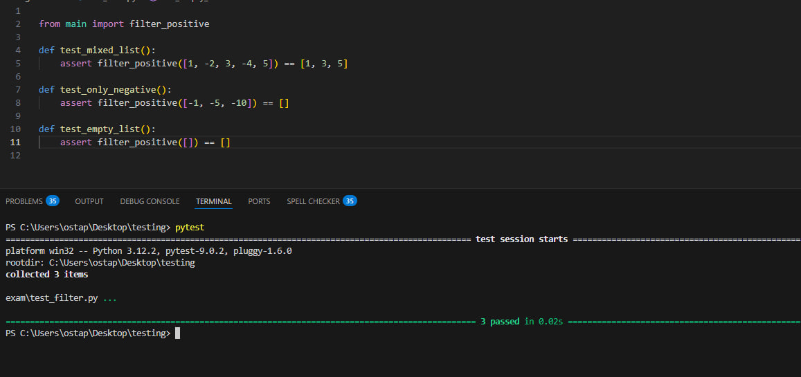

## Опис завдання

Потрібно реалізувати функцію `filter_positive(numbers)`, яка:
- приймає список чисел
- повертає новий список, що містить лише додатні числа (> 0)
- якщо у списку немає додатних чисел — повертає порожній список
- якщо список порожній — повертає порожній список

---

## Структура проєкту

```text
testing/
│
├── exam/
│   ├── main.py
│   └── test_filter.py
│
└── README.md


## Запускємо тести
  ```bash
  pytest ```
- результат 

